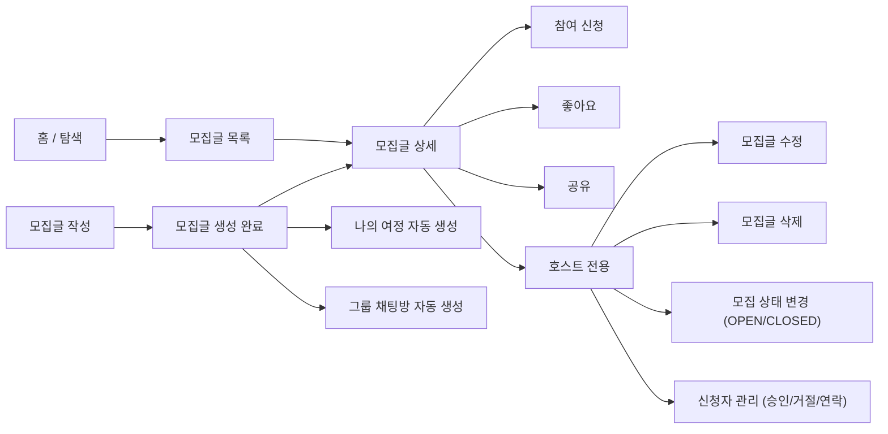

# 003. Post Product Flow

> 모집글은 여행 동행을 구하는 공개 게시글이며,
> 호스트가 조건을 설정하고 신청자를 받아 여행을 함께할 사람을 모집하는 공간이다.

이 문서는 `모집글` 기능을 처음 보는 사람이 아래를 한 번에 이해할 수 있도록 정리한 제품 흐름 문서다.

- 이 기능이 왜 필요한지
- 누가 어떤 상황에서 쓰는지
- 어떤 화면과 기능으로 구성되는지
- 상태와 권한 구조가 어떻게 나뉘는지

API 명세서나 ERD 전에 보는 `전체 그림 문서`라고 생각하면 된다.

---

## 1. 모집글이란?

`모집글`은 여행을 계획한 사람(호스트)이 함께 여행할 동행자를 공개적으로 모집하는 게시글이다.

호스트는 여행지, 일정, 모집 인원, 선호 성별/연령 등의 조건을 설정하고,
관심 있는 사용자가 신청하면 호스트가 검토 후 승인/거절한다.

> 모집글은 `참여 전` 공개 탐색 공간이고, 승인 이후에는 [나의 여정](001-my-journey-product-flow.md)으로 전환된다.

참여 신청과 승인 흐름의 상세는 [참여/그룹 채팅 흐름](002-participation-group-chat-flow.md)을 참고한다.

---

## 2. 왜 필요한가?

혼자 가기 망설여지는 여행을 동행자와 함께 가고 싶은 사람들이 있다.
이런 사람들이 서로를 찾을 수 있는 공개 공간이 필요하다.

- 여행지/일정/조건에 맞는 동행자를 찾기
- 동행 방식(전체/부분/식사)을 명확히 설정해서 기대 불일치 방지
- 관심 있는 여행을 저장(좋아요)하거나 탐색하기

---

## 3. 핵심 컨셉

### 모집글 작성 = 여정 공간 자동 생성

호스트가 모집글을 작성하는 순간 아래가 자동으로 함께 생성된다.

- `Journey` — 나의 여정 공간
- `JourneyMember` (HOST) — 호스트의 여정 멤버십
- `GroupChatRoom` — 그룹 채팅방

모집글은 단순한 게시글이 아니라 **여정 공간의 시작점**이다.

### 모집 마감일은 자동 계산

`recruitDeadline`은 호스트가 직접 설정하지 않고,
`endDate - 1일`로 자동 계산된다.

여행 종료일 전날까지만 신청을 받는다는 원칙을 코드로 강제한다.

### 모집글 수정 가능 기간

모집글 수정은 아래 조건을 모두 만족할 때만 가능하다.

- 모집 마감일이 지나지 않았음
- 여행이 시작되지 않았음
- 여행이 끝나지 않았음

여행이 시작된 이후에는 모집글을 수정할 수 없다.
(`canEditPost = false`로 클라이언트에 전달된다.)

### 자동 마감

매일 자정, 스케줄러가 실행되어 모집 마감일이 지난 모집글을 자동으로 `CLOSED` 처리한다.
이때 슈퍼호스트 노출 중인 게시글의 활성 노출도 함께 취소된다.

---

## 4. 사용자 구분

모집글에서 사용자는 크게 3가지로 나뉜다.

### 호스트 (Host)

- 모집글 작성자
- `posts.user_id`로 식별
- 모집글 수정/삭제/상태 변경 가능
- 신청자 관리(승인/거절/연락) 가능

### 신청자 (Applicant)

- 모집글에 참여 신청한 사용자
- `participations` 테이블에 row가 있음
- 자신의 신청 상태를 조회할 수 있음
- 신청 취소 가능 (PENDING, CONTACTING 상태에서만)

### 일반 사용자 (Visitor)

- 로그인 여부와 무관하게 모집글 목록/상세 조회 가능
- 비로그인 상태에서도 목록/상세 조회는 가능
- 신청, 좋아요, 수정/삭제는 로그인 필요

---

## 5. 모집글 상태

```
OPEN  ──────────────────────────────> CLOSED
       방장 수동 마감 / 자동 마감
       CLOSED ───────────────────────> OPEN
              방장 수동 재오픈
```

| 상태 | 설명 |
| --- | --- |
| `OPEN` | 모집 중. 신청, 승인, 연락 가능 |
| `CLOSED` | 마감됨. 신규 신청/승인/연락 불가. 그룹 채팅방은 유지 |

`FULL` 상태는 DB에 저장하지 않는다.
정원이 가득 찬 경우는 `isFull = (recruitCount >= recruitCapacity)`로 파생 계산한다.

---

## 6. 전체 사용자 흐름



---

## 7. 모집글 목록 조회

### 필터 / 정렬 조건

| 파라미터 | 타입 | 기본값 | 설명 |
| --- | --- | --- | --- |
| `keyword` | String | - | 제목/내용 검색 |
| `startDate` | LocalDate | - | 여행 시작일 이후 필터 |
| `endDate` | LocalDate | - | 여행 종료일 이전 필터 |
| `preferredGender` | Gender | - | 선호 성별 필터 |
| `preferredAge` | Integer | - | 선호 연령 필터 |
| `destinationId` | Long | - | 여행지 필터 |
| `isRecruitOpen` | Boolean | - | 모집 중인 글만 필터 |
| `sort` | PostSortType | `LATEST` | 정렬 조건 |
| `cursor` | Long | - | 커서 기반 페이지네이션 (직전 마지막 항목의 postId) |
| `size` | Integer | `10` | 페이지 크기 (최대 50) |

### 정렬 조건 (sort)

| 값 | 설명 | 정렬 기준 |
| --- | --- | --- |
| `LATEST` | 최신순 (기본) | `id DESC` |
| `VIEW` | 조회순 | `viewCount DESC, id DESC` |
| `LIKE` | 좋아요순 | `likeCount DESC, id DESC` |

동점 정렬 기준으로 항상 `id DESC`를 추가해 순서 안정성을 보장한다.

### 커서 기반 페이지네이션 (Keyset Pagination)

`cursor`가 없으면 첫 페이지, 있으면 해당 cursor 이후 데이터를 반환한다.
`size + 1`개를 조회해 `hasNext` 여부를 결정한다.

정렬 기준에 따라 커서 조건이 달라진다.

| sort | 커서 조건 |
| --- | --- |
| `LATEST` | `id < cursorId` |
| `VIEW` | `viewCount < cursorViewCount OR (viewCount = cursorViewCount AND id < cursorId)` |
| `LIKE` | `likeCount < cursorLikeCount OR (likeCount = cursorLikeCount AND id < cursorId)` |

구현 방식: `cursor` 값(postId)으로 커서 게시글을 1회 조회한 뒤, 해당 게시글의 `viewCount`/`likeCount`/`id`를 복합 조건으로 사용한다.

### 응답 필드 (PostSummaryResponse)

| 필드 | 타입 | 설명 |
| --- | --- | --- |
| `id` | Long | 게시글 ID |
| `title` | String | 제목 |
| `content` | String | 내용 |
| `status` | PostStatus | 모집 상태 |
| `isFull` | Boolean | 정원 초과 여부 |
| `daysUntilRecruitDeadline` | Integer | 모집 마감까지 남은 일수 |
| `daysUntilTravelStart` | Integer | 여행 시작까지 남은 일수 |
| `startDate` | LocalDate | 여행 시작일 |
| `endDate` | LocalDate | 여행 종료일 |
| `destination` | String | 여행지 도시명 |
| `recruitCapacity` | Integer | 모집 정원 |
| `recruitCount` | Integer | 현재 승인 인원 |
| `preferredGender` | Gender | 선호 성별 |
| `photoUrl` | String | 대표 사진 URL |
| `viewCount` | Integer | 조회수 |
| `likeCount` | Integer | 좋아요 수 |
| `author` | UserInfo | 작성자 (userId, nickname, profileImage) |
| `isSuperHost` | Boolean | 슈퍼호스트 노출 중 여부 |
| `superHostEndsAt` | LocalDateTime | 슈퍼호스트 노출 종료 시각 |
| `companionType` | CompanionType | 동행 방식 (`FULL` / `PARTIAL` / `MEAL`) |
| `hasLiked` | Boolean | 현재 사용자의 좋아요 여부 |

#### hasLiked 처리 방식

- 비로그인 요청(`userId = null`): 항상 `false`
- 로그인 요청: 페이지 내 모든 게시글 ID를 한 번에 IN 쿼리로 좋아요 여부를 벌크 조회해 N+1 없이 처리한다

```
SELECT pl.post_id
FROM post_likes pl
WHERE pl.user_id = :userId
  AND pl.post_id IN (:postIds)
```

---

## 8. 모집글 상세 조회

상세 조회 시 조회수(`viewCount`)가 1 증가한다.

응답에는 아래가 포함된다.

- 기본 정보: 제목, 내용, 여행지, 일정, 모집 조건
- 파생값: `tripDurationText`(여행 기간 텍스트), `recruitDeadlineDDay`(모집 마감 D-day)
- 권한값: `isOwner`, `canEditPost`
- 참여 정보: `participants`(승인된 참여자 목록), `myParticipationStatus`
- 좋아요: `hasLiked`

### 응답 필드 (PostDetailResponse) 주요 항목

| 필드 | 타입 | 설명 |
| --- | --- | --- |
| `companionType` | CompanionType | 동행 방식 (`FULL` / `PARTIAL` / `MEAL`) |
| `author` | PostAuthorInfo | 작성자 상세 정보 (아래 참조) |
| `participants` | List&lt;ParticipantInfo&gt; | 승인된 참여자 목록 (아래 참조) |
| `hasLiked` | Boolean | 현재 사용자의 좋아요 여부 |
| `isOwner` | Boolean | 현재 사용자가 호스트인지 여부 |
| `canEditPost` | Boolean | 수정 가능 여부 |
| `myParticipationStatus` | MyParticipationStatus | 현재 사용자의 신청 상태 |

#### PostAuthorInfo (author 필드)

목록 조회의 `UserInfo`와 달리, 상세 조회의 작성자 정보는 `PostAuthorInfo`를 사용한다.

| 필드 | 타입 | 설명 |
| --- | --- | --- |
| `userId` | Long | 작성자 ID |
| `nickname` | String | 닉네임 |
| `profileImage` | ProfileImageInfo | 프로필 이미지 (type, url, bgColorId) |
| `gender` | Gender | 성별 |
| `birthday` | LocalDate | 생년월일 |
| `isSuperHost` | Boolean | 슈퍼호스트 노출 중 여부 |

#### isSuperHost 판단 조건

`super_host_exposures` 테이블에서 해당 게시글 기준으로 아래 조건을 만족하는 row가 있으면 `true`다.

```
status = 'ACTIVE'
AND ended_at > 현재 시각
```

#### ParticipantInfo (participants 배열 각 항목)

| 필드 | 타입 | 설명 |
| --- | --- | --- |
| `userId` | Long | 참여자 ID |
| `nickname` | String | 닉네임 |
| `profileImage` | ProfileImageInfo | 프로필 이미지 |
| `isHost` | Boolean | 호스트 여부 |
| `gender` | Gender | 성별 |
| `birthday` | LocalDate | 생년월일 |

### canEditPost 계산

```
isOwner == true
AND 모집 마감일이 지나지 않음
AND 여행이 시작되지 않음
AND 여행이 끝나지 않음
```

여행이 시작된 다음 날부터는 `canEditPost = false`이다.

### myParticipationStatus

| 값 | 설명 |
| --- | --- |
| `NONE` | 신청한 이력 없음 (호스트 포함) |
| `PENDING` | 신청 완료, 방장 검토 대기 |
| `CONTACTING` | 방장이 1:1 채팅으로 연락 시작 |
| `APPROVED` | 수락 완료 |
| `REJECTED` | 거절됨 |
| `REMOVED_BY_HOST` | 승인 후 방장에게 내보내짐 |

---

## 9. 모집글 생성

### 생성 시 자동 처리

```
POST /api/v1/posts
    ↓
Post 저장
    ↓
Journey.create(post) 저장
    ↓
JourneyMember.createHost(journey, user) 저장
    ↓
GroupChatRoom 생성
```

모집글 생성 한 번으로 여정 운영에 필요한 기반이 모두 만들어진다.

### 주요 검증

- `title` — 5~40자
- `content` — 20~1000자
- `endDate >= startDate` — 종료일은 시작일과 같거나 이후여야 함
- `isAgeAny == true`이면 `minAge`, `maxAge`는 null이어야 함
- `isAgeAny == false`이면 `minAge`, `maxAge` 모두 필수 (20~100 범위)
- 태그는 최대 4개
- `recruitCapacity`는 2~10명 (호스트 포함)

### recruitDeadline 자동 계산

```
recruitDeadline = endDate - 1일
```

---

## 10. 모집글 수정

수정 가능 조건:

- 요청자가 호스트(`posts.user_id == userId`)
- `recruitDeadline`이 지나지 않았음
- 여행이 시작되지 않았음
- 여행이 끝나지 않았음

수정 시 `endDate`가 변경되면 `recruitDeadline`도 함께 재계산된다.

`recruitCapacity`를 줄일 때는 현재 `recruitCount`보다 작게 설정할 수 없다.

---

## 11. 모집글 삭제

소프트 삭제(`isDeleted = true`)로 처리한다.

삭제 시 슈퍼호스트 활성 노출을 함께 취소한다.

삭제된 게시글에서도 기존 그룹 채팅방은 유지된다.
(그룹 채팅방의 생명주기는 모집글과 분리된다.)

---

## 12. 모집 상태 변경

호스트가 직접 `OPEN` / `CLOSED`를 전환할 수 있다.

| 전환 방향 | 부수 효과 |
| --- | --- |
| `OPEN → CLOSED` | 슈퍼호스트 활성 노출 취소 |
| `CLOSED → OPEN` | 없음 |

---

## 13. 자동 마감 스케줄러

매일 자정(`0 0 0 * * *`)에 실행된다.

```
모집 마감일(recruitDeadline) < 오늘인 OPEN 게시글
    → status = CLOSED 일괄 업데이트
    → 슈퍼호스트 활성 노출 일괄 취소
```

---

## 14. 도메인 모델

### Post

| 필드 | 설명 |
| --- | --- |
| `user_id` | 호스트 |
| `destination_id` | 여행지 |
| `title` | 제목 (5~40자) |
| `content` | 내용 (20~1000자) |
| `start_date` | 여행 시작일 |
| `end_date` | 여행 종료일 |
| `recruit_capacity` | 모집 정원 (호스트 포함, 2~10명) |
| `recruit_count` | 현재 승인 인원 (초기값 1, 호스트 포함) |
| `recruit_deadline` | 모집 마감일 (`end_date - 1일`) |
| `preferred_gender` | 선호 성별 (`M`, `F`, `U`) |
| `is_age_any` | 연령 무관 여부 |
| `min_age` | 최소 선호 나이 |
| `max_age` | 최대 선호 나이 |
| `photo_url` | 대표 사진 URL |
| `tags` | 태그 (JSON 배열, 최대 4개) |
| `companion_type` | 동행 방식 (`FULL`, `PARTIAL`, `MEAL`) |
| `status` | 모집 상태 (`OPEN`, `CLOSED`) |
| `view_count` | 조회수 |
| `like_count` | 좋아요 수 |
| `is_deleted` | 소프트 삭제 여부 |

### CompanionType

| 값 | 설명 |
| --- | --- |
| `FULL` | 전체 동행 — 여행 전 기간 함께 |
| `PARTIAL` | 부분 동행 — 일부 일정만 함께 |
| `MEAL` | 식사 동행 — 식사만 함께 |

---

## 15. 권한 요약

| 기능 | 호스트 | 로그인 사용자 | 비로그인 |
| --- | --- | --- | --- |
| 목록 조회 | O | O | O |
| 상세 조회 | O | O | O |
| 모집글 작성 | O (작성자) | O | X |
| 모집글 수정 | O (조건부) | X | X |
| 모집글 삭제 | O | X | X |
| 상태 변경 | O | X | X |
| 참여 신청 | X (자신 글) | O | X |
| 좋아요 | O | O | X |

