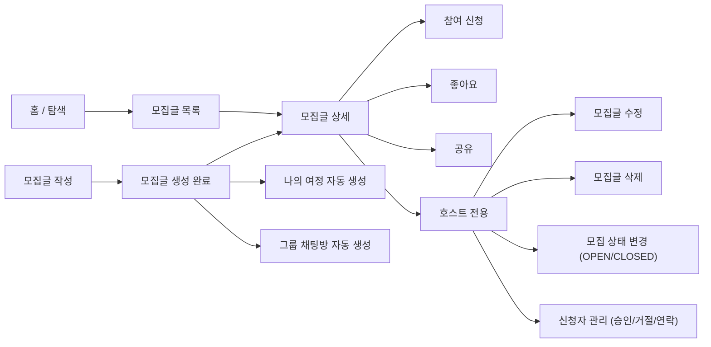

# 001. Post Product Flow

> 모집글은 여행 동행을 구하는 공개 게시글이며,
> 호스트가 조건을 설정하고 신청자를 받아 여행을 함께할 사람을 모집하는 공간이다.

이 문서는 `모집글` 기능을 처음 보는 사람이 아래를 한 번에 이해할 수 있도록 정리한 제품 흐름 문서다.

- 이 기능이 왜 필요한지
- 누가 어떤 상황에서 쓰는지
- 어떤 기능으로 구성되는지
- 상태와 권한 구조가 어떻게 나뉘는지

API 명세서나 ERD 전에 보는 `전체 그림 문서`라고 생각하면 된다.

---

## 1. 모집글이란?

`모집글`은 여행을 계획한 사람(호스트)이 함께 여행할 동행자를 공개적으로 모집하는 게시글이다.

호스트는 여행지, 일정, 모집 인원, 선호 성별/연령 등의 조건을 설정하고,
관심 있는 사용자가 신청하면 호스트가 검토 후 승인/거절한다.

> 모집글은 `참여 전` 공개 탐색 공간이고, 승인 이후에는 [나의 여정](004-my-journey-product-flow.md)으로 전환된다.

참여 신청과 승인 흐름의 상세는 [참여 신청 흐름](002-participation-flow.md)과 [동행 신청/그룹 채팅 흐름](003-participation-group-chat-flow.md)을 참고한다.

---

## 2. 왜 필요한가?

혼자 가기 망설여지는 여행을 동행자와 함께 가고 싶은 사람들이 있다.
이런 사람들이 서로를 찾을 수 있는 공개 공간이 필요하다.

- 여행지/일정/조건에 맞는 동행자를 찾기
- 동행 방식(전체/부분/식사)을 명확히 설정해서 기대 불일치 방지
- 관심 있는 여행을 저장(좋아요)하거나 탐색하기

---

## 3. 핵심 컨셉

### 모집글 작성 = 여정 기반 자동 생성

호스트가 모집글을 작성하는 순간 아래가 자동으로 함께 생성된다.

- `Journey` — 나의 여정 공간
- `JourneyMember` (HOST) — 호스트의 여정 멤버십
- `GroupChatRoom` — 그룹 채팅방

모집글은 단순한 게시글이 아니라 **여정 공간의 시작점**이다.

### 모집 마감일은 자동 계산

모집 마감일은 호스트가 직접 설정하지 않고 여행 종료일 전날로 자동 계산된다.

여행 종료일 전날까지만 신청을 받는다는 원칙을 코드로 강제한다.

### 모집글 수정 가능 기간

모집글 수정은 아래 조건을 모두 만족할 때만 가능하다.

- 모집 마감일이 지나지 않았음
- 여행이 시작되지 않았음
- 여행이 끝나지 않았음

여행이 시작된 이후에는 모집글을 수정할 수 없다.
(`canEditPost = false`로 클라이언트에 전달된다.)

### 자동 마감

매일 자정, 스케줄러가 실행되어 모집 마감일이 지난 모집글을 자동으로 `CLOSED` 처리한다.
이때 슈퍼호스트 노출 중인 게시글의 활성 노출도 함께 취소된다.

---

## 4. 사용자 구분

모집글에서 사용자는 크게 3가지로 나뉜다.

### 호스트 (Host)

- 모집글 작성자
- `posts.user_id`로 식별
- 모집글 수정/삭제/상태 변경 가능
- 신청자 관리(승인/거절/연락) 가능

### 신청자 (Applicant)

- 모집글에 참여 신청한 사용자
- 참여 신청 이력이 있음
- 자신의 신청 상태를 조회할 수 있음
- 신청 취소 가능 (`PENDING` 상태에서만)

### 일반 사용자 (Visitor)

- 로그인 여부와 무관하게 모집글 목록/상세 조회 가능
- 비로그인 상태에서도 목록/상세 조회는 가능
- 신청, 좋아요, 수정/삭제는 로그인 필요

---

## 5. 모집글 상태

```
OPEN  ──────────────────────────────> CLOSED
       방장 수동 마감 / 자동 마감
       CLOSED ───────────────────────> OPEN
              방장 수동 재오픈
```

| 상태 | 설명 |
| --- | --- |
| `OPEN` | 모집 중. 신청, 승인, 연락 가능 |
| `CLOSED` | 마감됨. 신규 신청/승인/연락 불가. 그룹 채팅방은 유지 |

`FULL` 상태는 DB에 저장하지 않는다.
정원이 가득 찬 경우는 `isFull = (recruitCount >= recruitCapacity)`로 파생 계산한다.

---

## 6. 전체 사용자 흐름



---

## 7. 목록/상세 정책

모집글 목록은 사용자가 여행 조건에 맞는 동행 모집글을 빠르게 탐색할 수 있어야 한다.

- 기본 조회는 모집 중이고 정원이 남은 게시글을 보여준다.
- 사용자는 키워드, 여행 기간, 선호 성별/연령, 여행지, 모집 상태, 동행 방식으로 목록을 좁힐 수 있다.
- 정렬은 최신순, 조회순, 좋아요순을 제공한다.
- 목록과 상세는 로그인 여부와 무관하게 조회할 수 있다.
- 로그인 사용자는 좋아요 여부와 내 신청 상태를 함께 확인할 수 있다.
- 상세 조회 시 조회수가 증가한다.

조회 조건의 세부 처리 방식은 [모집글 구현 문서](../../004-implementation/003-post.md)를 참고한다.

---

## 8. 모집글 생성

### 생성 시 자동 처리

모집글이 생성되면 아래 기반이 함께 준비된다.

- 공개 모집글
- 승인 이후 사용할 나의 여정 공간
- 호스트의 여정 멤버십
- 여정 멤버가 사용할 그룹 채팅방

모집글 생성 한 번으로 여정 운영에 필요한 기반이 모두 만들어진다.

### 주요 검증

- `title` — 5~40자
- `content` — 20~1000자
- 종료일은 시작일과 같거나 이후여야 함
- 연령 무관이면 최소/최대 연령을 받지 않음
- 연령 조건을 설정하면 최소/최대 연령이 모두 필요함 (20~100 범위)
- 태그는 최대 4개
- 모집 정원은 2~10명 (호스트 포함)

### recruitDeadline 자동 계산

모집 마감일은 여행 종료일 하루 전으로 계산한다.
```
recruitDeadline = endDate - 1일
```

---

## 9. 모집글 수정

수정 가능 조건:

- 요청자가 모집글 작성자(`posts.user_id == userId`)
- 모집 마감일(`recruitDeadline`)이 지나지 않았음
- 여행이 시작되지 않았음
- 여행이 끝나지 않았음

수정 시 `endDate`가 변경되면 `recruitDeadline`도 함께 재계산된다.

`recruitCapacity`를 줄일 때는 현재 `recruitCount`보다 작게 설정할 수 없다.

---

## 10. 모집글 삭제

모집글은 실제 데이터 삭제가 아니라 soft delete로 처리한다.

삭제 시 슈퍼호스트 활성 노출을 함께 취소한다.

삭제된 게시글에서도 기존 그룹 채팅방은 유지된다.
(그룹 채팅방의 생명주기는 모집글과 분리된다.)

---

## 11. 모집 상태 변경

호스트가 직접 `OPEN` / `CLOSED`를 전환할 수 있다.

| 전환 방향 | 부수 효과 |
| --- | --- |
| `OPEN → CLOSED` | 슈퍼호스트 활성 노출 취소 |
| `CLOSED → OPEN` | 없음 |

---

## 12. 자동 마감 스케줄러

매일 자정(`0 0 0 * * *`)에 실행된다.

모집 마감일이 지난 `OPEN` 게시글은 일괄 `CLOSED` 처리하고,
슈퍼호스트 활성 노출도 함께 취소한다.

---

## 13. 권한 요약

| 기능 | 호스트 | 로그인 사용자 | 비로그인 |
| --- | --- | --- | --- |
| 목록 조회 | O | O | O |
| 상세 조회 | O | O | O |
| 모집글 작성 | O (작성자) | O | X |
| 모집글 수정 | O (조건부) | X | X |
| 모집글 삭제 | O | X | X |
| 상태 변경 | O | X | X |
| 참여 신청 | X (자신 글) | O | X |
| 좋아요 | O | O | X |
