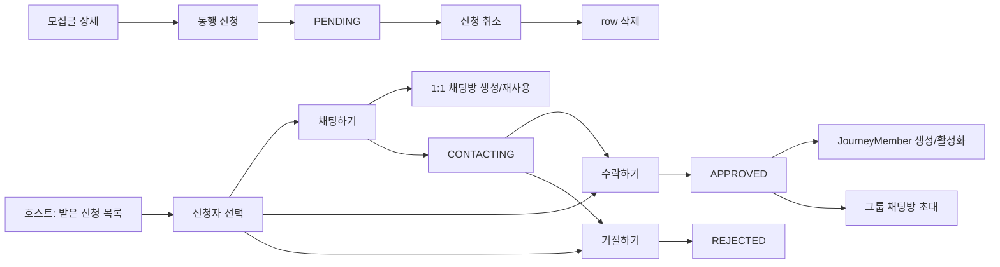

# 002. Participation Flow

> 참여 신청은 신청자가 모집글에 동행을 요청하고, 호스트가 검토 후 승인/거절하는 흐름이다.
> 승인이 확정되면 신청 이력은 유지되고, 협업 멤버십(`journey_members`)이 별도로 생성된다.

이 문서는 `참여 신청` 기능을 처음 보는 사람이 아래를 한 번에 이해할 수 있도록 정리한 제품 흐름 문서다.

- 신청자와 호스트 각각의 흐름이 어떻게 나뉘는지
- 상태 전이가 어떻게 이루어지는지
- 신청 이력(`participations`)과 여정 멤버십(`journey_members`)이 왜 분리되는지
- 락 순서와 동시성 처리 방식

전체 정책 기준은 [참여/그룹 채팅 흐름](003-participation-group-chat-flow.md)을 참고한다.

---

## 1. 핵심 컨셉

### 신청 이력과 여정 멤버십은 분리된다

`participations`는 신청과 승인 **이력**을 보관한다.
`journey_members`는 실제 협업 공간에 진입한 **현재 멤버십** 상태를 관리한다.

승인 이후 방장이 멤버를 내보내더라도 `participations.status`는 `APPROVED`로 유지된다.
내보내기 사실은 `journey_members.status = REMOVED`로 표현하고,
응답 시에만 `REMOVED_BY_HOST`로 파생 계산해서 내려준다.

### 신청 취소는 PENDING일 때만 가능

`CONTACTING` 이후에는 단순 신청 취소가 아니라 별도 흐름으로 처리한다.
취소 시 `participations` row를 삭제한다.

### 중복 신청 방지

`participations(post_id, user_id)` UNIQUE 제약으로 DB 수준에서 중복을 막는다.
동시성 충돌(DataIntegrityViolationException) 발생 시에도 중복 감지 후 예외를 반환한다.

### 락 순서

기존 참여 신청 row를 변경하는 흐름에서는 데드락 방지를 위해 동일 트랜잭션 내에서 반드시 아래 순서로 락을 잡는다.

```
Participation FOR UPDATE → Post FOR UPDATE
```

신청 생성은 아직 `Participation` row가 없으므로 예외적으로 `Post FOR UPDATE`를 먼저 잡고, 검증 후 `Participation` row를 생성한다.

---

## 2. 사용자 구분

### 신청자 (Applicant)

- 모집글에 참여 신청한 사용자
- `participations.user_id`로 식별
- 신청 생성, 내 신청 내역 조회, 신청 취소 가능

### 호스트 (Host)

- 모집글 작성자
- `posts.user_id`로 식별
- 받은 신청 목록 조회, 연락 시작, 승인, 거절 가능

---

## 3. 참여 신청 상태

```
        신청자 취소 (row 삭제)
            ↑
[없음] ──── PENDING ──────────────────> REJECTED
                │                        ↑
                │ 호스트 채팅하기           │
                ↓                        │ 호스트 거절
            CONTACTING ─────────────> REJECTED
                │
                │ 호스트 수락
                ↓
            APPROVED
```

| 상태 | 설명 |
| --- | --- |
| `PENDING` | 신청 완료. 호스트 액션 대기 중 |
| `CONTACTING` | 호스트가 1:1 채팅으로 연락 시작 |
| `APPROVED` | 수락 완료. 그룹 채팅방 자동 초대 및 여정 멤버 등록 |
| `REJECTED` | 거절됨. 재신청 불가 (`UNIQUE` 제약으로 row 유지) |

`REMOVED_BY_HOST`는 DB 상태가 아니라, `APPROVED` + `journey_members.status = REMOVED`를 조합해서 응답에만 표현하는 파생 상태다.

---

## 4. 전체 사용자 흐름



---

## 5. 신청자 흐름

### 5.1 동행 신청

**조건**

- 자신의 모집글에는 신청 불가
- 모집글이 `OPEN` 상태여야 함
- 정원이 가득 차지 않아야 함 (`recruitCount < recruitCapacity`)
- 이미 신청한 이력이 없어야 함 (REJECTED row가 남아 있으면 재신청 불가)

**처리 순서**

1. `Post`를 `FOR UPDATE`로 잠금
2. 신청 가능 조건 검증
3. `Participation` row 생성 (상태: `PENDING`)
4. 동시성 충돌 시 `DataIntegrityViolationException` 포착 → 중복 신청 예외 반환

### 5.2 내 신청 내역 조회

신청한 모든 모집글의 신청 상태와 채팅방 ID를 함께 반환한다.

| 신청 상태 | 포함되는 채팅방 ID |
| --- | --- |
| `PENDING` | 없음 |
| `CONTACTING` | `privateRoomId` (1:1 채팅방) |
| `APPROVED` + journey ACTIVE | `groupRoomId` (그룹 채팅방) |
| `APPROVED` + journey REMOVED | 없음 |
| `REJECTED` | 없음 |

`cancellable` 필드는 신청 상태가 `PENDING`일 때만 `true`이다.

### 5.3 신청 취소

- `PENDING` 상태에서만 가능
- `Participation` row를 삭제한다
- 삭제 후 같은 모집글에 재신청 가능하다

---

## 6. 호스트 흐름

### 6.1 받은 신청 목록 조회

상태(`PENDING`, `CONTACTING`, `APPROVED`, `REJECTED`)로 필터링해서 조회한다.
미지정 시 전체 신청을 반환한다.

### 6.2 채팅하기 (연락 시작)

**조건**

- 요청자가 모집글 호스트
- 모집글이 `OPEN`이고 정원이 가득 차지 않아야 함
- 신청 상태가 `PENDING`이어야 함

**처리 순서**

1. `Participation` → `Post` 순서로 락 획득
2. 1:1 채팅방 생성 또는 기존 방 재사용
3. 신청 상태를 `CONTACTING`으로 변경

### 6.3 수락

**조건**

- 요청자가 모집글 호스트
- 모집글이 `OPEN`이고 정원이 가득 차지 않아야 함
- 신청 상태가 `PENDING` 또는 `CONTACTING`이어야 함

**처리 순서**

1. `Participation` → `Post` 순서로 락 획득
2. `Post.approveParticipation()` 호출 → 내부에서 `participation.approve()` (상태 `APPROVED` 전환) + `recruitCount` 증가
3. `JourneyMember` 생성 (이미 있으면 활성화)
4. 그룹 채팅방에 자동 초대

수락 시 `participations.status = APPROVED`와 `journey_members` 생성이 함께 처리된다.

### 6.4 거절

**조건**

- 요청자가 모집글 호스트
- 모집글이 `OPEN`이고 정원이 가득 차지 않아야 함
- 신청 상태가 `PENDING` 또는 `CONTACTING`이어야 함

**처리**

- `Participation.status = REJECTED`로 변경
- `participations` row는 유지됨 → 재신청 불가

---

## 7. 상태 전이표

| 현재 상태 | 액션 | 다음 상태 | 비고 |
| --- | --- | --- | --- |
| 없음 | 신청자: 동행 신청 | `PENDING` | row 생성 |
| `PENDING` | 신청자: 신청 취소 | (삭제) | row 삭제 |
| `PENDING` | 호스트: 채팅하기 | `CONTACTING` | 1:1 채팅방 생성/재사용 |
| `PENDING` | 호스트: 수락 | `APPROVED` | JourneyMember 생성, 그룹방 초대 |
| `PENDING` | 호스트: 거절 | `REJECTED` | row 유지 |
| `CONTACTING` | 호스트: 수락 | `APPROVED` | JourneyMember 생성, 그룹방 초대 |
| `CONTACTING` | 호스트: 거절 | `REJECTED` | row 유지 |
| `APPROVED` | 호스트: 멤버 내보내기 | `APPROVED` 유지 | `journey_members.status = REMOVED` |

---

## 8. 응답 상태 계산 (MyParticipationStatus)

신청자 화면에 내려가는 상태는 DB 상태를 그대로 쓰지 않고 파생 계산한다.

```
participations.status == APPROVED
    AND journey_members.status == REMOVED
    → REMOVED_BY_HOST

그 외
    → participations.status 그대로 사용
```

호스트(`isOwner == true`) 또는 비로그인(`currentUserId == null`)이면 `NONE`을 반환한다.

---

## 9. 서비스 책임 분리

### ParticipationApplicantService

신청자 관점의 기능을 담당한다.

- 신청 생성 및 중복/자기 신청 검증
- 내 신청 내역 조회 (채팅방 ID 포함)
- 신청 취소
- 모집글 상세의 참여자 목록 제공 (`journey_members` 기반)
- 내 신청 상태 조회 (`myParticipationStatus`)

### ParticipationCommandService

호스트 관점의 커맨드를 담당한다.

- 받은 신청 목록 조회
- 연락 시작 (1:1 채팅방 생성 + 상태 전환)
- 승인 (그룹방 초대 + JourneyMember 생성 + recruitCount 증가)
- 거절

---

## 10. 도메인 모델

### Participation

| 필드 | 설명 |
| --- | --- |
| `post_id` | 신청 대상 모집글 |
| `user_id` | 신청자 |
| `status` | 신청 상태 (`PENDING`, `CONTACTING`, `APPROVED`, `REJECTED`) |
| `message` | 신청 메시지 (최대 500자) |
| `contacted_at` | 연락 시작 시각 |
| `approved_at` | 승인 시각 |
| `rejected_at` | 거절 시각 |

**UNIQUE 제약**: `(post_id, user_id)`

이 제약 덕분에:
- `REJECTED` row가 남아 있으면 재신청이 DB 수준에서 막힌다
- 신청 취소는 row 삭제이므로 재신청이 가능하다
- 방장 내보내기는 신청 이력을 유지하면서 `journey_members`로만 접근을 차단한다

---

## 11. 예외 규칙

| 상황 | 예외 |
| --- | --- |
| 자신의 모집글에 신청 | `SelfParticipationNotAllowedException` |
| 모집 마감/정원 가득 참 | `RecruitmentClosedException` |
| 이미 신청한 이력 있음 | `DuplicateParticipationException` |
| 신청 상태 전이 불가 | `InvalidParticipationStatusException` |
| 자신의 신청이 아닌데 취소 | `ParticipationApplicantAccessDeniedException` |
| 호스트가 아닌데 수락/거절 | `PostAccessDeniedException` |
| 신청 ID와 게시글 ID 불일치 | `ParticipationPostMismatchException` |
