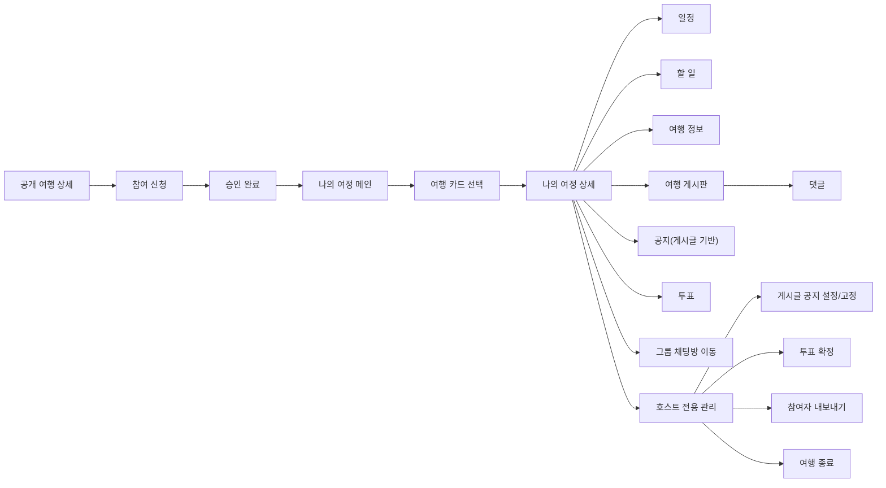

# My Journey Product Flow

> 나의 여정은 참여가 확정된 여행의 멤버들이 함께 준비하고 운영하는 협업 공간이며,
> 호스트는 최종 확정과 관리 권한을 갖고 참여자는 공동 편집 권한을 가진다.

이 문서는 `나의 여정` 기능을 처음 보는 사람이 아래를 한 번에 이해할 수 있도록 정리한 제품 흐름 문서다.

- 이 기능이 왜 필요한지
- 누가 어떤 상황에서 쓰는지
- 어떤 화면과 기능으로 구성되는지
- 권한 구조가 어떻게 나뉘는지

API 명세서나 ERD 전에 보는 `전체 그림 문서`라고 생각하면 된다.
개발 진행 상태와 설계 포인트는 [MY_JOURNEY_IMPLEMENTATION.md](./MY_JOURNEY_IMPLEMENTATION.md)를 참고한다.

---

## 1. 나의 여정이란?

`나의 여정`은 단순히 "내가 참여한 여행 목록"이 아니라,
`여행에 속한 사람들이 함께 준비하고 운영하는 협업 공간`이다.

기존 여행 상세 페이지가 여행을 `탐색`하고 `참여 신청`하는 화면이라면,
나의 여정은 참여가 확정된 뒤부터 여행이 끝날 때까지 사용하는 `여행 워크스페이스`에 가깝다.

> 여행 모집글이 `참여 전 상세 페이지`라면, 나의 여정은 `참여 후 운영 공간`이다.

---

## 2. 왜 필요한가?

여행은 참여 신청으로 끝나지 않는다.
실제로는 여행 전후로 아래 같은 협업이 계속 일어난다.

- 일정을 같이 다듬기
- 할 일을 나누기
- 필요한 정보를 추가하기
- 여행 게시판에 글과 댓글 남기기
- 공지로 설정된 게시글 확인하기
- 투표로 의견 모으기
- 채팅방으로 바로 이동하기

즉, 여행이 시작되면 기존 `모집글 상세`만으로는 부족하고,
참여자들이 함께 쓰는 별도 공간이 필요하다.

---

## 3. 핵심 컨셉

### 확정/관리만 호스트 권한

호스트만 할 수 있는 것은 `최종 확정`과 `관리` 성격의 기능이다.

- 게시글 공지 설정/고정
- 투표 확정
- 참여자 관리(내보내기)
- 여행 종료

### 나머지는 협업 중심

호스트만 다 하는 구조가 아니라,
`호스트 + 승인 참여자`가 같이 편집하고 운영하는 느낌을 유지한다.

- 일정 수정
- 할 일 수정
- 정보 추가
- 게시글 작성
- 댓글 작성

즉, 나의 여정은 `호스트 전용 관리 도구`가 아니라
`호스트가 최종 권한을 갖는 공동 작업 공간`이다.

---

## 4. 사용자 구분

나의 여정에서는 사용자를 아래 2가지 `멤버 역할`로 본다.

### HOST

- 여행 모집글 작성자
- `journey_members.role = HOST`
- 여행 운영의 최종 책임자

### MEMBER

- 실제 여행에 합류한 일반 멤버
- `journey_members.role = MEMBER`
- 호스트와 함께 협업 기능을 사용할 수 있음

일반 사용자는 나의 여정의 멤버가 아니다.
별도 `VISITOR` 역할로 저장하지 않고 `journey member가 없는 사용자`로 본다.

### 왜 `journey_members`를 분리했나?

기존 구조는 아래처럼 나뉘어 있었다.

- 호스트: `posts.user_id`
- 참여 신청 이력: `participations`

이 구조는 `모집글` 단계에서는 자연스럽지만,
나의 여정처럼 공지, 일정, 투표, 게시판, 댓글, 참여자 관리까지 들어가는
`협업형 여행 도메인`에서는 불편해진다.

그래서 현재는 역할을 이렇게 나눈다.

- `posts` — 여행/모집글 루트
- `participations` — 신청 이력 (`PENDING / CONTACTING / APPROVED / REJECTED`)
- `journey_members` — 실제 협업 멤버십 (`HOST / MEMBER`, `ACTIVE / REMOVED / LEFT`)

즉, `참여 신청`과 `실제 여행 멤버십`을 분리해서 본다.

---

## 5. 시간 흐름으로 보는 나의 여정

나의 여정은 한 화면이 아니라, 여행의 생명주기를 따라가는 기능이다.

### 여행 전

협업 기능 사용 빈도가 가장 높다.

- 일정 조율, 할 일 분담, 여행 정보 정리
- 공지로 설정된 게시글 확인
- 투표 진행, 게시글/댓글로 소통

### 여행 중

실시간 운영이 중심이다.

- 변경된 일정 반영, 현장 정보 추가
- 공지 확인 및 업데이트, 투표 결과 반영
- 채팅 이동

`모집글 수정`보다 `운영 기능`이 훨씬 중요한 시기다.

### 여행 종료 후

읽기 중심으로 전환된다.

- 일정/정보/게시글 기록 조회, 댓글 기록 조회
- 대부분의 협업 기능은 닫고 기록과 회고 중심으로 넘어간다.

---

## 6. 전체 사용자 흐름

---

## 7. 권한 요약

### 호스트만 가능한 것

- 게시글 공지 설정/고정
- 투표 확정
- 참여자 내보내기
- 여행 종료
- 모집글 원본 수정

### 호스트 + 참여자 공통

- 일정 조회/수정
- 할 일 조회/수정
- 여행 정보 조회/추가
- 여행 게시판 조회/작성
- 댓글 조회/작성
- 채팅방 이동

### 권한 철학

나의 여정에서 중요한 것은 `상태 이름`보다 `행동 가능 여부`다.

`journeyStatus` 같은 값보다, 현재 이 사용자가 active member인지, 호스트인지,
`canEditPost` 같은 현재 화면에 바로 필요한 값을 정확히 내려주는 방향이 적합하다.

`모집글 원본 수정`과 `나의 여정 운영`은 같은 권한이 아니다.

- `canEditPost` — 모집글 원본 수정 가능 여부
- `canEditSchedule`, `canPinNotice`, `canFinalizePoll` 등 — 나의 여정 운영 기능 가능 여부

운영 권한의 기준은 궁극적으로 `participations`가 아니라 `journey_members`가 된다.

---

## 8. 기능 묶음별 설명

### 일정

여행 일정을 Day 기준으로 관리하는 기능이다.

- 여행 기간 기준 Day 자동 생성
- 일정 아이템 조회/추가/수정/삭제
- 장소/시간/메모 관리

### 할 일

여행 준비에 필요한 작업을 분담하는 기능이다.

- 할 일 추가/상태 변경/수정/삭제

### 여행 정보

여행에 필요한 참고 정보를 누적하는 기능이다.

- 준비물, 참고 링크, 집합 장소, 전달사항

### 여행 게시판

여행 멤버끼리 소통하는 공간이다.

- 게시글 작성/조회/수정/삭제
- 댓글 작성/수정/삭제 (작성자 본인), 삭제 (호스트도 가능)

댓글은 별도 부가 기능이 아니라 `게시판 협업 경험의 핵심 요소`에 가깝다.

**홈 댓글 노출 규칙**

- 댓글 0개: 댓글 영역 미노출 또는 Empty
- 댓글 1~2개: 전체 노출
- 댓글 3개 이상: 최신 2개만 먼저 노출 후 `댓글 더보기 (N)` 버튼으로 확장/접기 토글 (`hasMoreComments` + `previewComments`로 제공)

**홈 게시글 삭제 UX**

- 더보기 메뉴에서 `삭제하기` 클릭 시 즉시 삭제하지 않음
- 확인 모달을 먼저 띄운 뒤 사용자가 확인해야 실제 삭제 API 호출

### 공지

공지는 별도 엔티티가 아니라 `여행 게시판의 게시글 중 공지로 설정된 글`이다.

- 모든 참여자가 게시글 작성 가능
- 게시글 작성자 본인만 수정/삭제 가능
- 호스트는 게시글을 공지로 설정/해제할 수 있음 (최대 3개)
- 공지로 설정된 게시글은 목록 상단 우선 노출

### 투표

의견을 모으고 최종 결정을 반영하는 기능이다.

- 투표 생성/참여/결과 조회
- 호스트의 최종 확정

### 채팅 연동

대화가 필요한 경우 그룹 채팅방으로 바로 이동하는 흐름이다.

- 상세 하단 CTA에서 그룹 채팅방 ID 기반 이동
- 그룹 채팅방은 공개 모집글(`post`)이 아니라 나의 여정(`journey`)과 1:1로 연결된다.
