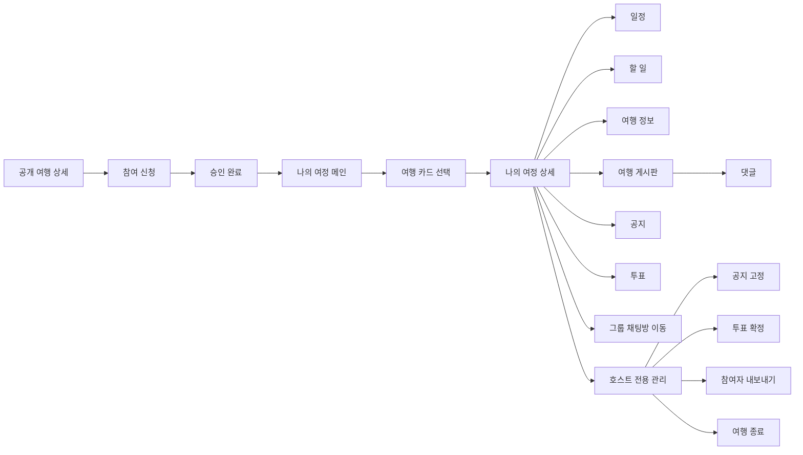

# My Journey Product Flow

## 1. 이 문서의 목적

이 문서는 `나의 여정` 기능을 처음 보는 사람도

- 이 기능이 왜 필요한지
- 누가 어떤 상황에서 쓰는지
- 어떤 화면과 기능으로 구성되는지
- 백엔드는 어떤 흐름으로 개발될 예정인지

를 한 번에 이해할 수 있도록 정리한 제품 흐름 문서다.

즉, API 명세서나 ERD 전에 보는 `전체 그림 문서`라고 생각하면 된다.

---

## 2. 나의 여정이란?

`나의 여정`은 단순히 “내가 참여한 여행 목록”이 아니라,
`여행에 속한 사람들이 함께 준비하고 운영하는 협업 공간`이다.

기존 여행 상세 페이지가 여행을 `탐색`하고 `참여 신청`하는 화면이라면,
나의 여정은 참여가 확정된 뒤부터 여행이 끝날 때까지 사용하는 `여행 워크스페이스`에 가깝다.

한 줄로 정리하면:

> 여행 모집글이 `참여 전 상세 페이지`라면, 나의 여정은 `참여 후 운영 공간`이다.

---

## 3. 왜 필요한가?

여행은 참여 신청으로 끝나지 않는다.
실제로는 여행 전후로 아래 같은 협업이 계속 일어난다.

- 일정을 같이 다듬기
- 할 일을 나누기
- 필요한 정보를 추가하기
- 여행 게시판에 글과 댓글 남기기
- 공지 확인하기
- 투표로 의견 모으기
- 채팅방으로 바로 이동하기

즉, 여행이 시작되면 기존 `모집글 상세`만으로는 부족하고,
참여자들이 함께 쓰는 별도 공간이 필요하다.

---

## 4. 핵심 컨셉

이번 기획의 핵심은 아주 명확하다.

### 4-1. 확정/관리만 호스트 권한

호스트만 할 수 있는 것은 `최종 확정`과 `관리` 성격의 기능이다.

- 공지 고정
- 투표 확정
- 참여자 관리(내보내기)
- 여행 종료

### 4-2. 나머지는 협업 중심

호스트만 다 하는 구조가 아니라,
`호스트 + 승인 참여자`가 같이 편집하고 운영하는 느낌을 유지한다.

- 일정 수정
- 할 일 수정
- 정보 추가
- 게시글 작성
- 댓글 작성

즉, 나의 여정은 `호스트 전용 관리 도구`가 아니라
`호스트가 최종 권한을 갖는 공동 작업 공간`이다.

---

## 5. 사용자 구분

나의 여정에서는 사용자를 아래 2가지 `멤버 역할`로 본다.

### HOST

- 여행 모집글 작성자
- `journey_members.role = HOST`
- 여행 운영의 최종 책임자

### MEMBER

- 실제 여행에 합류한 일반 멤버
- `journey_members.role = MEMBER`
- 호스트와 함께 협업 기능을 사용할 수 있음

일반 사용자는 나의 여정의 멤버가 아니다.
즉, 별도 `VISITOR` 역할로 저장하지 않고
`journey member가 없는 사용자`로 본다.

---

## 5-1. 왜 `journey_members`를 분리했나?

기존 구조는 아래처럼 나뉘어 있었다.

- 호스트: `posts.user_id`
- 참여 신청 이력: `participations`

이 구조는 `모집글` 단계에서는 자연스럽지만,
나의 여정처럼 공지, 일정, 투표, 게시판, 댓글, 참여자 관리까지 들어가는
`협업형 여행 도메인`에서는 불편해진다.

그래서 현재는 역할을 이렇게 나눈다.

- `posts`
  - 여행/모집글 루트
- `participations`
  - 신청 이력
  - `PENDING / CONTACTING / APPROVED / REJECTED`
- `journey_members`
  - 실제 협업 멤버십
  - `HOST / MEMBER`
  - `ACTIVE / REMOVED / LEFT`

즉, `참여 신청`과 `실제 여행 멤버십`을 분리해서 본다.

---

## 6. 시간 흐름으로 보는 나의 여정

나의 여정은 한 화면이 아니라, 여행의 생명주기를 따라가는 기능이다.

### 6-1. 여행 전

여행 전에는 준비가 중심이다.

- 일정 조율
- 할 일 분담
- 여행 정보 정리
- 공지 확인
- 투표 진행
- 게시글/댓글로 소통

이 시기에는 협업 기능 사용 빈도가 가장 높다.

### 6-2. 여행 중

여행 중에는 실시간 운영이 중심이다.

- 변경된 일정 반영
- 현장 정보 추가
- 공지 업데이트
- 투표 결과 반영
- 채팅 이동

이 시기에는 `모집글 수정`보다 `운영 기능`이 훨씬 중요하다.

### 6-3. 여행 종료 후

여행 종료 후에는 읽기 중심으로 전환된다.

- 일정/정보/게시글 기록 조회
- 댓글 기록 조회
- 여행 히스토리/기록 기능과 연결

종료 후에는 대부분의 협업 기능은 닫고, 기록과 회고 중심으로 넘어간다.

---

## 7. 전체 사용자 흐름

---

## 8. 화면 기준 흐름

### 8-1. 공개 여행 상세

여기는 아직 `참여 전` 화면이다.

- 일반 사용자가 여행 내용을 확인한다
- 참여 신청을 한다
- 공개 게시글 성격의 UI를 본다

여기서는 여행을 `탐색`하는 경험이 중심이다.

### 8-2. 나의 여정 메인

참여가 확정되면 사용자는 나의 여정 메인으로 들어온다.

- 내가 속한 여행 카드 목록을 본다
- 카드 클릭 시 해당 여행의 나의 여정 상세로 이동한다
- 성격상 “찜 목록”이나 “탐색 목록”이 아니라 `워크스페이스 진입 목록`이다

백엔드에서는 이 목록을 더 이상
`내가 호스트인 여행 + 내가 APPROVED 참여한 여행`을 임시로 합쳐서 보는 게 아니라,
`journey_members` 기준으로 조회하는 방향이 더 적합하다.

### 8-3. 나의 여정 상세

이 화면이 핵심이다.

여기서 현재 foundation 단계의 백엔드는 먼저 아래 2가지를 판단한다.

- `isOwner`
  - 내가 이 여행의 호스트인지
- `canEditPost`
  - 모집글 원본 수정 가능 여부

그리고 실제 협업 권한의 기준은
`journey_members.role / status`를 통해 판단하게 된다.

프론트는 이 값을 기준으로

- 버튼 노출 여부
- 수정 가능 여부
- 호스트 전용 UI 노출 여부

를 제어한다.

---

## 9. 권한 철학

나의 여정에서 중요한 것은 `상태 이름`보다 `행동 가능 여부`다.

예를 들어 지금 당장은

- 모집중
- 모집완료
- 여행중
- 종료

같은 별도 상태값보다,

- 이 사람이 나의 여정에 접근 가능한가
- 일정을 수정할 수 있는가
- 공지를 고정할 수 있는가
- 투표를 확정할 수 있는가

가 더 중요하다.

그래서 지금은 `journeyStatus` 같은 값보다,
`현재 이 사용자가 이 여행의 active member인지`, `호스트인지`,
`canEditPost` 같은 현재 화면에 바로 필요한 값을 정확히 내려주는 방향이 적합하다.

---

## 10. 권한 요약

### 10-1. 호스트만 가능한 것

- 공지 고정
- 투표 확정
- 참여자 내보내기
- 여행 종료
- 모집글 원본 수정

### 10-2. 호스트 + 참여자 공통

- 일정 조회/수정
- 할 일 조회/수정
- 여행 정보 조회/추가
- 여행 게시판 조회/작성
- 댓글 조회/작성
- 채팅방 이동

### 10-3. 일반 사용자

- 나의 여정 사용 대상 아님
- 기존 공개 여행 상세 사용
- 코드 모델에서는 별도 role을 두지 않고 `journey member가 없는 사용자`로 본다

---

## 11. 모집글 수정과 나의 여정 협업은 다르다

이 부분은 구현할 때 자주 헷갈릴 수 있다.

`모집글 원본 수정`과 `나의 여정 운영`은 같은 권한이 아니다.

예를 들어 여행이 시작된 뒤에는

- 제목/본문/모집 조건 같은 모집글 원본 수정은 막을 수 있음
- 하지만 일정/정보/공지/투표 같은 운영 기능은 계속 열어둘 수 있음

즉,

- `canEditPost`
  - 모집글 원본 수정 가능 여부
- `canEditSchedule`, `canPinNotice`, `canFinalizePoll` 등
  - 나의 여정 운영 기능 가능 여부

를 분리해서 봐야 한다.

이때 운영 권한의 기준은 궁극적으로
`participations`가 아니라 `journey_members`가 된다.

---

## 12. 기능 묶음별 설명

### 12-1. 일정

여행 일정을 Day 기준으로 관리하는 기능이다.

- 여행 기간 기준 Day 자동 생성
- 일정 아이템 조회
- 일정 추가/수정/삭제
- 장소/시간/메모 관리

### 12-2. 할 일

여행 준비에 필요한 작업을 분담하는 기능이다.

- 할 일 추가
- 상태 변경
- 수정/삭제

### 12-3. 여행 정보

여행에 필요한 참고 정보를 누적하는 기능이다.

- 준비물
- 참고 링크
- 집합 장소
- 전달사항

### 12-4. 여행 게시판

여행 멤버끼리 소통하는 공간이다.

- 게시글 작성
- 게시글 조회
- 게시글 수정/삭제
- 댓글 작성/수정/삭제

### 12-5. 공지

여행 내 중요한 안내사항을 모아두는 기능이다.

- 공지 조회
- 공지 작성/수정/삭제
- 호스트의 공지 고정

### 12-6. 투표

의견을 모으고 최종 결정을 반영하는 기능이다.

- 투표 생성
- 투표 참여
- 결과 조회
- 호스트의 최종 확정

### 12-7. 채팅 연동

대화가 필요한 경우 그룹 채팅방으로 바로 이동하는 흐름이다.

- 상세 하단 CTA
- 그룹 채팅방 ID 기반 이동

---

## 13. 댓글 기능은 어디에 들어가나?

댓글은 `여행 게시판`의 하위 기능으로 본다.

즉, 이번 나의 여정 범위에서 댓글은 별도 부가 기능이 아니라
`게시판 협업 경험의 핵심 요소`에 가깝다.

관련해서 홈 피드 쪽 UX 변경도 함께 관리한다.

### 홈 댓글 노출 규칙

- 댓글 0개: 댓글 영역 미노출 또는 Empty
- 댓글 1~2개: 전체 노출
- 댓글 3개 이상: 최신 2개만 먼저 노출
- `댓글 더보기 (N)` 버튼으로 확장/접기 토글

### 홈 게시글 삭제 UX

- 더보기 메뉴에서 `삭제하기` 클릭 시 즉시 삭제하지 않음
- 확인 모달을 먼저 띄움
- 사용자가 확인해야 실제 삭제 API 호출

---

## 14. 백엔드에서 어떻게 보게 될까?

백엔드 관점에서 나의 여정은 아래처럼 이해하면 된다.

### 도메인 구분

- `posts`
  - 여행/모집글 루트
- `participations`
  - 신청 과정 관리
- `journey_members`
  - 실제 협업 멤버 관리

현재 나의 여정 관련 권한과 목록 조회는
점점 `journey_members`를 중심으로 이해하는 편이 맞다.

### 읽기 모델

- 나의 여정 메인 목록 조회
- 나의 여정 상세 조회
- 일정/공지/투표/게시판/댓글 조회

### 쓰기 모델

- 일정 수정
- 할 일 수정
- 정보 추가
- 게시글/댓글 작성
- 공지 고정
- 투표 확정
- 참여자 내보내기
- 여행 종료

### 상세 응답 핵심값

- `isOwner`
- `myParticipationStatus`
- `canEditPost`

프론트는 이 정보를 기준으로 화면을 그린다.

---

## 15. 개발은 어떤 순서로 진행되나?

전체 개발 흐름은 아래 순서가 가장 안전하다.

### 1단계. 정책 확정

- 누가 무엇을 할 수 있는지
- 호스트 전용 권한은 무엇인지
- 공통 협업 권한은 어디까지인지
- `participations`와 `journey_members`의 역할 경계를 어디까지 둘지

### 2단계. 공통 상세 응답

- `isOwner`
- `myParticipationStatus`
- `canEditPost`

상세 화면이 어떤 기준으로 그려질지 먼저 고정한다.

### 3단계. 메인/상세 진입

- 나의 여정 메인 목록
- 나의 여정 상세 조회

이 단계부터는 목록과 참여자 조회를 `journey_members` 기준으로 정리하는 것이 유리하다.

### 4단계. 협업 도메인 순차 개발

- 일정
- 할 일
- 여행 정보
- 여행 게시판
- 댓글
- 공지
- 투표

### 5단계. 호스트 전용 관리 기능

- 공지 고정
- 투표 확정
- 참여자 내보내기
- 여행 종료

---

## 16. 이번 기능을 한 문장으로 요약하면

> 나의 여정은 참여가 확정된 여행의 멤버들이 함께 준비하고 운영하는 협업 공간이며, 호스트는 최종 확정과 관리 권한을 갖고 참여자는 공동 편집 권한을 가진다.

---

## 17. 팀원이 이 문서를 읽고 이해해야 하는 핵심

이 문서를 읽고 나면 아래가 머릿속에 남아야 한다.

1. 나의 여정은 `참여 후 워크스페이스`다.
2. 호스트만 다 하는 구조가 아니라 `협업형`이다.
3. 호스트는 `확정/관리`, 참여자는 `공동 편집`에 가깝다.
4. 일반 사용자는 나의 여정 대상이 아니며, 별도 role이 아니라 `멤버십 없음`으로 본다.
5. 신청 이력(`participations`)과 실제 멤버십(`journey_members`)은 분리해서 본다.
6. 구현 핵심은 `상태값`보다 현재 화면에 필요한 최소 응답값과 멤버십 기준 권한을 정확히 내려주는 것이다.
