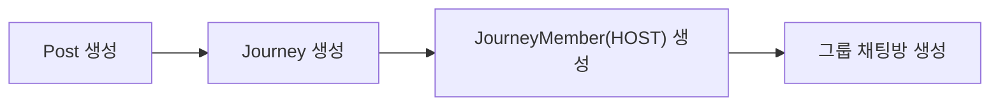
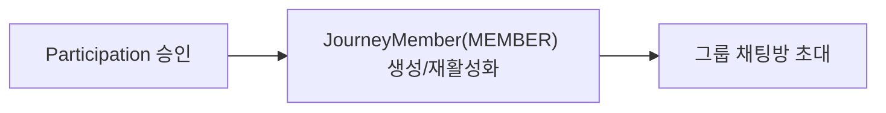
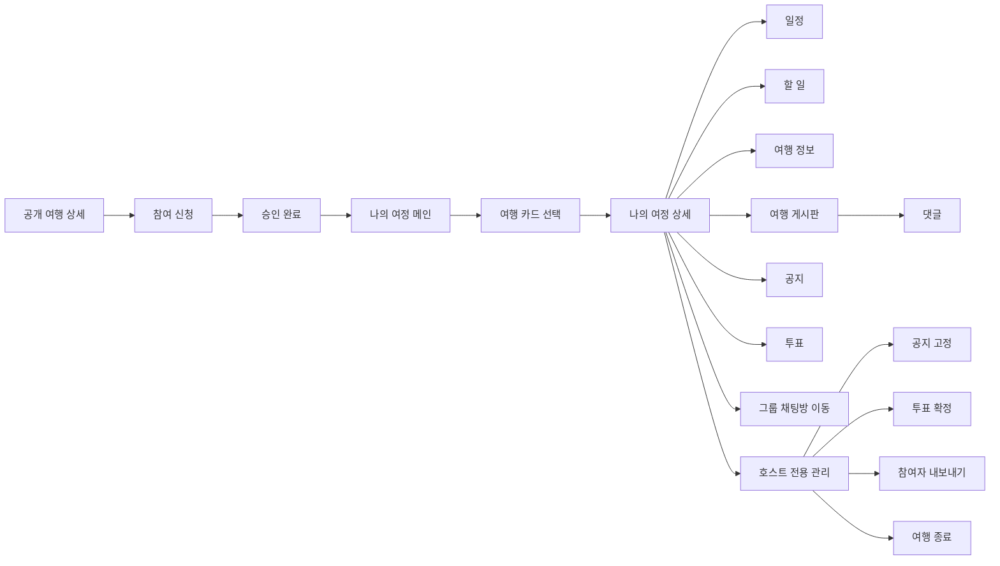

# My Journey Product Flow

## 1. 문서 목적

이 문서는 `나의 여정` 기능을 처음 보는 사람도 아래 내용을 한 번에 이해할 수 있도록 정리한 문서다.

- 나의 여정이 어떤 제품인지
- 공개 모집글과 무엇이 다른지
- 어떤 도메인으로 구성되는지
- 사용자가 어떤 흐름으로 진입하고 사용하는지
- 백엔드가 어떤 기준으로 설계되는지

즉, API 명세서나 ERD 전에 보는 `제품/도메인 흐름 문서`다.

---

## 2. 나의 여정이란?

`나의 여정`은 참여가 확정된 사람들끼리 여행을 함께 준비하고 운영하는 협업 공간이다.

- 공개 여행 상세: 참여 전 탐색/신청 화면
- 나의 여정: 참여 후 운영/협업 화면

한 줄로 정리하면:

> 모집글이 `밖으로 보여주는 공개 입구`라면, 나의 여정은 `안에서 쓰는 여행 워크스페이스`다.

---

## 3. 왜 별도 공간이 필요한가?

여행은 신청만으로 끝나지 않는다. 참여가 확정된 이후에는 이런 협업이 이어진다.

- 일정 조율
- 할 일 분담
- 공지 확인
- 투표 진행/확정
- 여행 정보 추가
- 게시글/댓글 작성
- 그룹 채팅 이동

즉, 여행 모집글만으로는 참여 후 경험을 감당하기 어렵고, 멤버들이 계속 쓰는 별도 공간이 필요하다.

---

## 4. 핵심 컨셉

### 4-1. 확정/관리만 호스트 권한

호스트만 할 수 있는 기능은 `최종 확정`과 `멤버 관리` 성격의 기능이다.

- 공지 고정
- 투표 확정
- 참여자 관리(내보내기)
- 여행 종료

### 4-2. 나머지는 협업 중심

호스트 혼자 관리하는 구조가 아니라 `호스트 + 실제 멤버`가 같이 편집하고 운영하는 느낌을 유지한다.

- 일정 수정
- 할 일 수정
- 정보 추가
- 게시글 작성
- 댓글 작성

즉, 나의 여정은 `호스트 전용 관리자 페이지`가 아니라 `호스트가 최종 권한을 가진 협업 공간`이다.

---

## 5. 도메인 구조

현재 나의 여정은 아래 4개 도메인으로 이해하면 된다.

### 5-1. `posts`

공개 모집글 도메인이다.

- 공개 상세 화면
- 모집 상태
- 모집 인원
- 신청 가능 여부
- 참여 신청/승인 흐름의 기준

즉, `참여 전 공개 입구` 역할을 맡는다.

### 5-2. `journeys`

나의 여정 워크스페이스 도메인이다.

- 나의 여정 메인 카드
- 나의 여정 상세
- 일정/공지/투표/게시판/기록의 상위 루트

`post` 생성 시 함께 만들어지며, 생성 시점에 공개 모집글의 일부 값을 초기값으로 저장한다.

- 제목
- 대표 이미지

중요한 점은:

> 생성 시 처음 한 번만 같은 값으로 저장하고, 이후에는 `post`와 `journey`를 자동 동기화하지 않는다.

즉, 이후에는

- `post`는 공개 모집글로 수정
- `journey`는 여행 워크스페이스로 수정

이렇게 서로 독립적으로 운영한다.

### 5-3. `participations`

참여 신청 이력 도메인이다.

- `PENDING`
- `CONTACTING`
- `APPROVED`
- `REJECTED`

즉, `들어오기 전 과정`을 관리한다.

### 5-4. `journey_members`

실제 협업 멤버십 도메인이다.

- `role`: `HOST`, `MEMBER`
- `status`: `ACTIVE`, `REMOVED`, `LEFT`

즉, `들어온 뒤 현재 이 여행의 실제 멤버가 누구인가`를 관리한다.

---

## 6. 왜 `journey`와 `journey_members`를 분리하나?

기존 구조는 아래와 같았다.

- 호스트: `posts.user_id`
- 승인 참여자: `participations.status = APPROVED`

이 구조는 모집 단계에는 자연스럽지만, 협업 기능이 많아질수록 아래 문제가 생긴다.

- 호스트와 참여자가 다른 축에 저장됨
- 현재 실제 멤버를 한 번에 조회하기 어려움
- 일정/공지/투표/게시판 권한 판단이 분산됨
- 내보내기/탈퇴 같은 상태를 표현하기 애매함

그래서 현재는 이렇게 본다.

- `post`: 공개 모집글
- `journey`: 협업 워크스페이스
- `participation`: 신청 이력
- `journey_member`: 실제 협업 멤버십

즉, `신청 이력`과 `현재 협업 멤버십`을 분리해서 관리한다.

---

## 7. 멤버 역할

### HOST

- 여행 모집글 작성자
- `journey_members.role = HOST`
- 여행 운영의 최종 책임자

### MEMBER

- 실제 여행에 합류한 일반 멤버
- `journey_members.role = MEMBER`
- 호스트와 함께 협업 기능을 사용할 수 있음

### 일반 사용자

일반 사용자는 나의 여정의 멤버가 아니다.

- 별도 `VISITOR` role로 저장하지 않음
- 그냥 `journey member가 없는 사용자`로 판단
- 공개 상세만 이용 가능

---

## 8. 생성 시점 흐름

현재 기준 생성 흐름은 아래와 같다.

설명:

1. 호스트가 공개 모집글을 만든다.
2. 같은 시점에 나의 여정용 `journey`를 함께 만든다.
3. 호스트를 `journey_members`에 `HOST`로 넣는다.
4. 그룹 채팅방도 함께 만든다.

이후 참여 승인 시에는:

즉, `participation`은 승인 이력을 남기고, 실제 협업 권한은 `journey_member`가 갖는다.

---

## 9. 시간 흐름으로 보는 나의 여정

### 9-1. 여행 전

- 일정 조율
- 할 일 분담
- 정보 정리
- 공지 확인
- 투표 진행
- 게시글/댓글 소통

협업 기능 사용 빈도가 가장 높은 시기다.

### 9-2. 여행 중

- 현장 일정 조정
- 공지 업데이트
- 투표 결과 반영
- 채팅 이동

이 시기에는 `모집글 수정`보다 `운영 기능`이 훨씬 중요하다.

### 9-3. 여행 종료 후

- 읽기 중심으로 전환
- 일정/정보/게시글 기록 조회
- 여행 기록/히스토리 기능과 연결

종료 후에는 대부분의 협업 기능을 닫고, 기록 중심으로 넘어간다.

---

## 10. 전체 사용자 흐름

---

## 11. 화면 기준 흐름

### 11-1. 공개 여행 상세

- 일반 사용자가 여행 내용을 확인한다
- 참여 신청을 한다
- 공개 게시글 성격의 UI를 본다

여기서는 여행을 `탐색`하는 경험이 중심이다.

### 11-2. 나의 여정 메인

- 내가 속한 여행 카드 목록을 본다
- 카드 클릭 시 `journeyId` 기준으로 상세에 진입한다
- 성격상 `찜 목록`이 아니라 `워크스페이스 진입 목록`이다

백엔드는 이 목록을 `journey_members` 기준으로 조회한다.

### 11-3. 나의 여정 상세

이 화면이 핵심이다.

이제 상세는 더 이상 `PostDetailResponse` 자체가 아니라 `Journey` 기준 응답이다.

- 루트: `journey`
- 보조 정보: `journey.post`
- 멤버 정보: `journey_members`
- 채팅방 연결: `post`에 연결된 그룹 채팅방

즉, 공개 상세를 그대로 재사용하는 것이 아니라 `journey` 워크스페이스 정보를 중심으로 보여준다. 현재 `journey`는 제목/대표 이미지처럼 나의 여정에서 독립 수정이 필요한 최소 정보만 직접 가지고, 본문/기간/목적지/모집 정보는 연결된 `post`를 참조한다.

---

## 12. 권한 기준

나의 여정에서 중요한 것은 `상태 이름`보다 `무엇을 할 수 있는가`다.

현재 기준은 아래처럼 이해하면 된다.

- 이 사람이 `ACTIVE journey member`인가
- `HOST`인가 `MEMBER`인가
- 공개 모집글 수정 정책은 별도로 `post` 규칙을 따르는가

즉,

- 협업 권한 기준: `journey_members`
- 모집글 수정 기준: `posts`

으로 나뉜다.

---

## 13. 모집글 수정과 나의 여정 운영은 다르다

중요한 점은 `모집글 원본 수정`과 `나의 여정 운영`은 같은 권한이 아니라는 점이다.

- 공개 모집글 수정
  - `post` 기준 정책을 따른다
- 나의 여정 협업 권한
  - 일정/공지/투표/게시판 운영 가능 여부
  - `journey_member` 기준

즉, 여행이 시작된 뒤에는 모집글 수정은 닫혀도 나의 여정 협업 기능은 계속 열려 있을 수 있다.

---

## 14. 채팅과의 관계

채팅은 기준 모델이 아니라 결과 반영 모델로 본다.

- 여행 멤버십 기준: `journey_members`
- 채팅방 멤버십 기준: `chat_room_members`

즉,

- 누가 현재 여행 멤버인가 → `journey_members`
- 누가 채팅방에 들어가 있는가 → `chat_room_members`

향후 참여자 내보내기/탈퇴가 생기면, 먼저 `journey_member` 상태가 바뀌고 그 결과로 채팅방 상태를 함께 반영한다.

---

## 15. 한 줄 요약

> 나의 여정은 공개 모집글(`post`)과 분리된 여행 워크스페이스(`journey`)이며, `journey`는 제목/대표 이미지 같은 최소 워크스페이스 정보만 직접 갖고 나머지는 `post`를 참조한다. 참여 신청(`participation`)과 실제 협업 멤버십(`journey_member`)도 분리해 관리한다.
